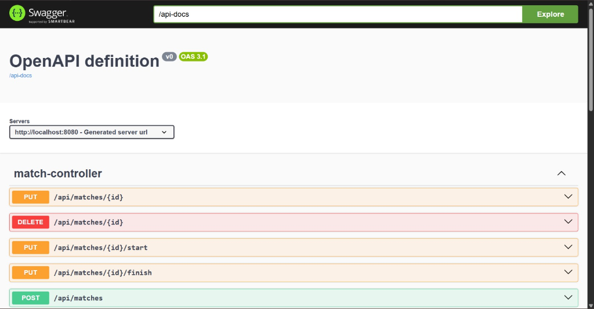
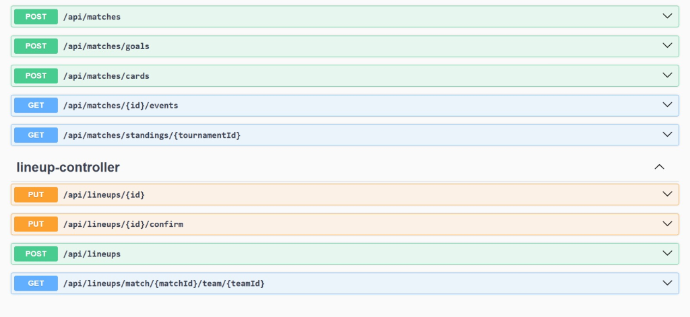
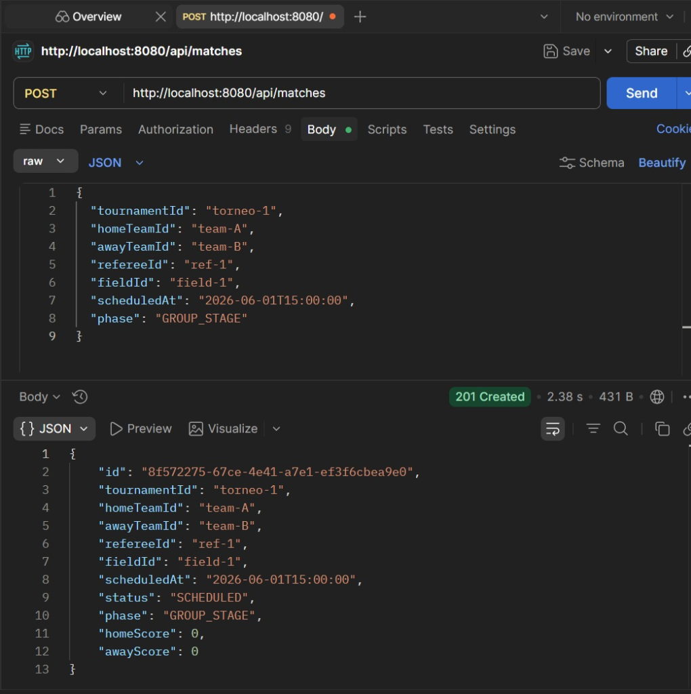
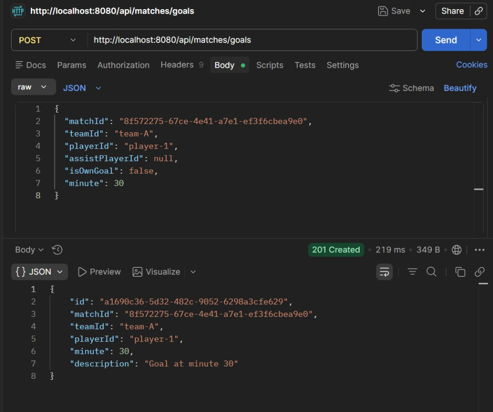
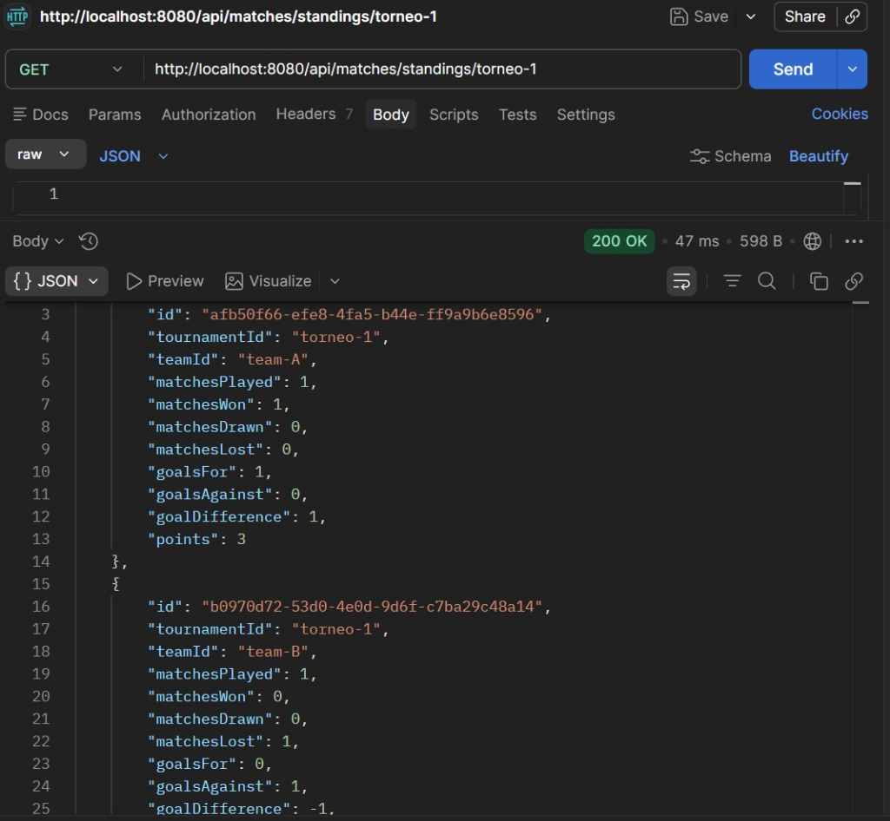
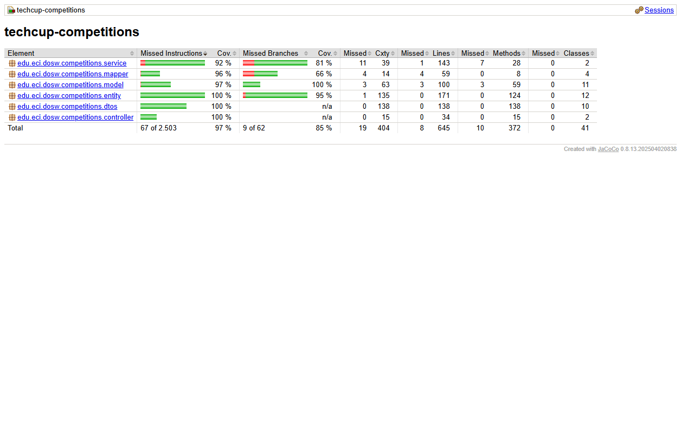

# TechCup Competitions - Tournament Management Microservice

## General Description

**TechCup Competitions** is a microservice developed in **Java with Spring Boot** responsible for managing the development of the TechCup football tournament. It manages the complete lifecycle of matches, lineups, in-game events (goals, cards), change auditing, and the automatic calculation of the standings table.

### Main Features:
- **Match Management**: Creation and control of the match lifecycle (Scheduled, In Progress, Finished, Cancelled).
- **Lineups**: Administration of the starting and substitute roster per team for each match, with size validations.
- **Game Events**: Real-time registration of goals (including own goals and assists) and cards (yellow/red).
- **Standings**: Automatic and real-time calculation of points, goal difference, and team statistics after a match finishes.
- **Auditing**: Complete traceability of actions and changes made to matches.
- **Hybrid Storage**: Use of PostgreSQL for structured data and complex relationships, and MongoDB prepared for documents or unstructured data.

---

## Technologies

| Layer | Technology | Version |
|-------|------------|---------|
| Backend | Spring Boot | 3.4.0 |
| Language | Java | 21 |
| Build | Apache Maven | 3.x |
| Persistence (SQL) | Spring Data JPA / Hibernate | 3.4.0 / 6.x |
| Persistence (NoSQL)| Spring Data MongoDB | 3.4.0 |
| Mapping | MapStruct | 1.6.3 |
| Database | PostgreSQL + MongoDB | 15 / 6 |
| In-Memory DB (tests) | H2 | latest |
| Validation | Spring Boot Validation | 3.4.0 |
| API Docs | SpringDoc OpenAPI | 2.8.0 |
| Testing | JUnit Jupiter + Mockito + MockMvc | 5.x |
| Quality | JaCoCo + SonarQube | 0.8.13 / 3.10.0 |
| CI/CD | GitHub Actions + Azure Web Apps | - |

---

## Requirements

- Java 21
- Apache Maven 3.9+
- Docker (to run PostgreSQL and MongoDB)

---

## Layered Architecture

The microservice follows a clean layered design, applying SOLID principles to ensure low coupling and high cohesion:

| Layer | Responsibility | Description |
|------|-----------------|-------------|
| **Controller** | REST entry point | Orchestrates the reception of requests (DTOs) and HTTP responses. |
| **Service** | Business logic | Implements tournament rules, coordinating models and persistence. |
| **Repository** | Persistence | Spring Data JPA interfaces for database access. |
| **Model** | Domain and State | Pure Java classes that implement design patterns (e.g., State Pattern) to control allowed transactions. |
| **Mapper** | Data transformation | Uses MapStruct for efficient conversion between Entities and DTOs. |

---

## Domain Model

The domain centralizes its logic in Matches and their derivatives:

- **Match**: Core entity defining the encounter between two teams in a tournament phase.
- **Lineup**: Manages the players assigned to a specific match per team.
- **MatchEvent**: Base entity for recording on-pitch occurrences.
  - **Goal**: Records the scorer, assist, and type (normal/own goal).
  - **Card**: Records disciplinary sanctions.
- **Standings**: Statistical accumulation per team within a tournament.
- **MatchAudit**: Immutable historical record of operations on matches.

### Implemented Design Patterns:
- **State Pattern**: Controls which actions are valid based on the current match state (e.g., goals cannot be registered in a "Scheduled" or "Finished" match). It also governs lineups ("Confirmed" vs. "Unconfirmed").
- **Builder Pattern**: Used for clean and structured creation of new matches.

---

## Database Model

The relational schema in PostgreSQL is designed to maintain tournament integrity:

- **matches**: Stores match information and status.
- **lineups**: Relates teams and matches with player lists.
- **match_events (and derived tables `goals`, `cards`)**: Uses JPA inheritance (JOINED) for polymorphic events.
- **standings**: Maintains the consolidated standings table.
- **match_audits**: Historical record of actions.

> **Note**: References to Tournaments, Teams, and Players are stored as identifiers (Strings) since these master data are managed by other microservices in the TechCup ecosystem (such as the Teams microservice).

---

## Architectural Flow

Within the TechCup ecosystem, the main flow of this service is: **Frontend / REST Client -> API Gateway -> Competitions Service**

1. **Actors**: Tournament organizers (create matches, register results) and Referees/Desk (register live events).
2. **Entry and Routing**: All requests pass first through the API Gateway, which validates JWT authentication tokens.
3. **Core Logic**: The `techcup-competitions` service processes the request applying the state engine rules (State Pattern).
4. **Persistence**: Changes are saved in PostgreSQL and the standings tables are updated automatically.

---

## API Documentation (Swagger/OpenAPI)

The API features interactive documentation via Swagger UI, allowing exploration of match, lineup, event, and standings endpoints.




---

## Postman Testing and Validation

The system has been exhaustively tested simulating tournament flows:

### 1. Match Creation
Testing the insertion of a new encounter, validating its initial state as "SCHEDULED".



### 2. Goal Registration
Testing the real-time registration of events associated with the match ID.



### 3. Standings Query
Testing the automatic calculation of points and goal difference after match events.



---

## Code Quality and Automated Testing

The project includes a robust suite of unit and integration tests covering:
- State pattern tests to ensure no invalid transitions occur.
- Business logic validations in Services using Mockito.
- Repository tests with in-memory databases (H2).
- Full integration tests (MockMvc) simulating real HTTP requests.

**JaCoCo** is used to ensure code coverage and **SonarQube** for static analysis.



---

## CI/CD Pipeline

The project uses GitHub Actions for continuous integration and deployment to Azure Web Apps. The pipeline triggers on every push to the `main` and `develop` branches, and on pull requests targeting `main`. It runs four sequential jobs:

| Job | Description |
|-----|-------------|
| Build | Checks out the code, sets up Java 21 (Temurin distribution), and compiles the project |
| Test | Depends on Build; runs the full test suite including unit and integration tests |
| Quality | Depends on Test; generates JaCoCo coverage reports and sends them to SonarCloud |
| Deploy | Depends on Quality; packages the application as a JAR and deploys it to Azure Web Apps |

---

## Docker Configuration and Deployment

The microservice is containerized and supports easy local deployments via Docker.

### Local Execution with Docker Compose
Starts the required infrastructure (PostgreSQL and MongoDB):
```bash
docker-compose up -d
```
Then, compile and run the application:
```bash
mvn spring-boot:run
```

---

## Git Branching Strategy

Each feature was developed in isolation and merged via Pull Requests to the `develop` branch:

| Branch | Content |
|--------|---------|
| feature/entities-competition | JPA entity classes, enums, and entity tests |
| feature/dtos-competitions | Data Transfer Objects and DTO tests |
| feature/class-diagram | Class diagram documentation |
| feature/repository | Spring Data JPA repository interfaces and repository tests |
| feature/service | Business logic services and service tests |
| feature/model | State pattern models and model tests |
| feature/mapper-competition | MapStruct mappers and mapper tests |
| feature/controller-competition | REST controllers, controller tests, integration tests, and Dockerfile |
| feature/api | API configuration and OpenAPI setup |
| feature/deployment | CI/CD pipeline Azure deployment step and environment variables |

---